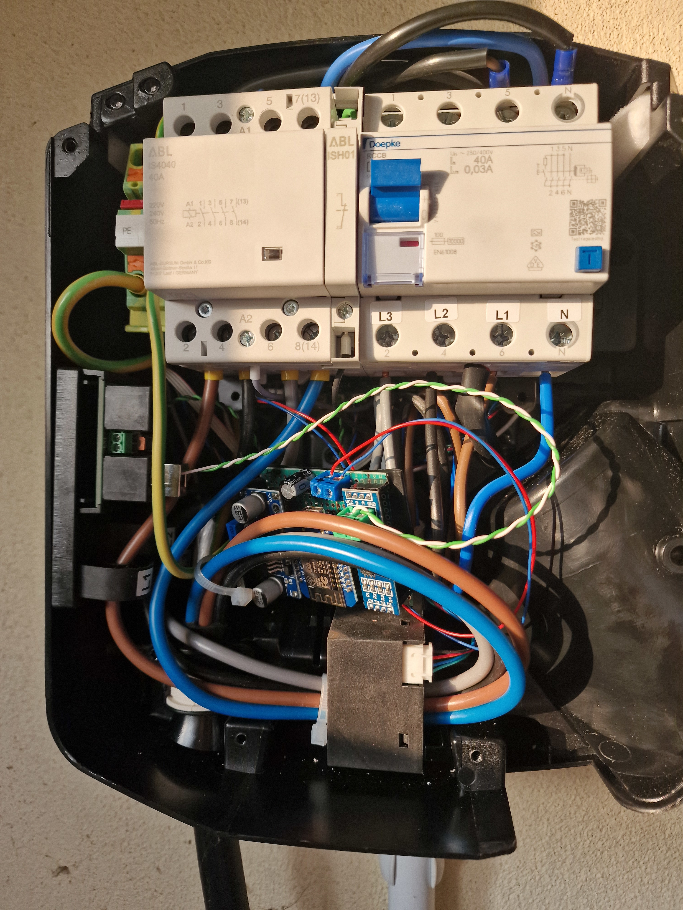

A week ago I wondered if I could integrate my ABL eMH1 22kW with my Huawei 
Fusion Solar inverter. Thanks to ESPHome and 
[a project on GitHub by jrv](https://github.com/jrv/esphome-abl-emh1/) this is 
not only a dream. Although 
[the forum post](https://community.home-assistant.io/t/connecting-the-abl-emh1-ev-charger-as-esphome-component/705488/) 
on the Home Assistant forum specifies other hardware I got it working. I ended 
up using a Wemos D1 mini (or a clone of it) with a DC-DC step down converter 
and a MAX485 TTL converter for the MODBUS communication with the wallbox.

## BOM & Wiring Schema

### Bill Of Materials

- Wemos D1 mini
- DC-DC step down module (needs to be capable of stepping down 12V)
- MAX485 TTL module
- 1000μF electrolytic capacitor
- ciruit board to fit everything on
- RJ45 crimp connector

```box { type=note }
I added a capacitor to potentially smooth out the voltage and to cushion 
potential current spikes of the ESP. I don't know if this is strictly necessary 
but it's good parctise.
```

### Schema


## Connecting to the wallbox

Inside the eMH1 there is a header with 12V, might be hard to see on the picture 
but it's deep inside to the bottom left of the circuit board 
(where I attached the red and blue wires). The headers are labeled **12V** and 
**M** for +12V and GND respectively.
```box { type=important }
The DC-DC stepdown converter needs to be "configured" otherwise you will fry 
your ESP. Plug the module into the 12V of the wallbox and it will most likely 
output 12V as well. You will need to turn the potentiometer on the module so 
that it will output 5V. Measure with a multimeter.
```


My wallbox uses RJ45 jacks for the RS485 interface so I crimped my own 
connector according to the pinout 
[@zwartevogel](https://community.home-assistant.io/u/zwartevogel/) sent on the 
forum. Different models and wallboxes manufactured before or after a certain 
date seem to have different connection types for the RS485 bus so check yours 
before buying your materials. The **M** pins are just another ground connection. 
Depending on your step down converter you might want to connect these pins to 
your ground bus. Mine uses the same ground for the in- and output so I don't 
need to do this.


In case you have two sockets for the RS485 bus either use the one where it says 
**CONTROL** or use the first one (the one on the bottom). If you connect to a 
**METER** socket you will likely not be able to change the amperage or other 
settings of the device.


I covered the backside of my board with electrical tape and chucked it into the 
enclosure of the wallbox and closed it back up.



## Configuring

But before you can control the wallbox you will need to configure your ESP. 
Inside the GitHub repository there is an example config file for ESPHome. Copy 
that into the editor of ESPHome but don't install yet. You will first need to 
do the changes listed below because we are using a different ESP and ESP board 
and therefore a different pinout.



```yaml
substitutions:
  name: abl_emh1
  device_description: "Monitor and configure ABL eMH1 Charger via RS485/Modbus-ASCII"
  external_components_source: https://github.com/jrv/esphome-abl-emh1
  tx_pin: "GPIO1"
  rx_pin: "GPIO3"
  flow_control_pin: "GPIO12"

# ...

# replacing esp32
esp8266:
  board: d1_mini

# redirecting the logging uart to the second one (only TX) for good measure
# see https://esphome.io/components/uart.html#hardware-uarts
# I don't know if this is necessary
logger:
  hardware_uart: "UART1"

# ...
```

Now you can compile and upload the firmware to your ESP.

If you don't see any errors in the logs of the ESP you should now be able to 
see the charge status of your wallbox and change the amperage on the fly.

If you have a solar power plant you can create scripts in Home Assistant to 
adjust the amperage to match the amperage of the output and never pay for your 
battery charges again.
